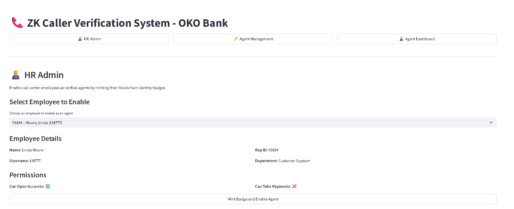

# ZK Caller Verification System

A secure identity verification system for call centers using zero-knowledge proofs on the blockchain. This system provides a robust solution for verifying call center agent identities while maintaining privacy and preventing identity theft through blockchain-based authentication.

## System Overview

The ZK Caller Verification System implements a secure, decentralized approach to call center agent verification using zero-knowledge proofs. This ensures that:

- Agent identities are securely verified without exposing sensitive information
- Each verification is cryptographically secure and tamper-proof
- The system maintains privacy while providing strong authentication
- Verification can be performed in real-time during calls

## Key Features

- **Blockchain-based Identity Verification**: Secure agent identity verification using zero-knowledge proofs
- **One-time Verification Codes**: Unique, time-limited codes for secure caller authentication
- **HR Management Portal**: Streamlined interface for managing agent verification and permissions
- **Real-time Verification**: Instant verification of agent identity during calls
- **Privacy-Preserving**: Zero-knowledge proofs ensure sensitive data remains private

## UI Screenshots

### HR Management Interface


_Main HR interface for managing agent verification and permissions_

### Badge Minting Interface


_Interface for minting blockchain identity badges for verified agents_

### Agent Verification Interface


_Agent dashboard for generating and managing one-time verification codes_

### System Deployment


_Blockchain deployment verification and system status_

## Quick Start

To run the application with a single command, use the `main.py` script:

```bash
python main.py
```

This will:

1. Initialize the database (if not already done)
2. Create test data with sample employees and agents
3. Launch the Streamlit UI

## Command Line Options

```
Usage: python main.py [OPTIONS]

Options:
  --skip-init          Skip database initialization
  --skip-test-data     Skip test data creation
  --employees INT      Number of test employees to create (default: 10)
  --agents INT         Number of test agents to enable (default: 5)
  --username TEXT      Admin username for database initialization
  --password TEXT      Admin password for database initialization
  --non-interactive    Run in non-interactive mode
```

## Examples

### Create more test data

```bash
python main.py --employees 20 --agents 10
```

### Skip test data creation

```bash
python main.py --skip-test-data
```

### Non-interactive mode (for scripting)

```bash
python main.py --non-interactive --username admin --password securepass123
```

## Application Tabs

The application has three main tabs:

1. **HR Admin**: Enable call center employees as verified agents by minting blockchain identity badges
2. **Agent Dashboard**: View agent details and generate one-time verification codes
3. **Agent Management**: Manage existing agent accounts and permissions

## Development

For development purposes, you can run individual scripts:

- Initialize database: `python scripts/init_db.py`
- Create test data: `python scripts/create_test_data.py --count 10 --enable 5`
- Run Streamlit app: `streamlit run ui/streamlit_app.py`
